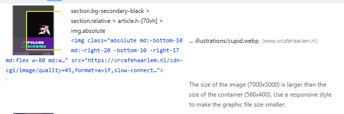
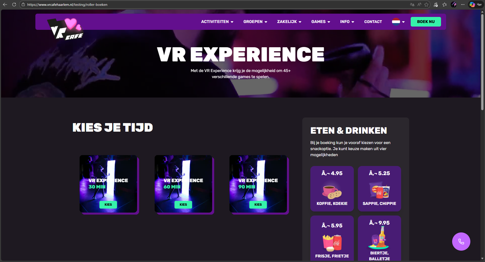

# Presentation Ivan and Sidney
In this presentation Ivan and I will show what we found when doing our research for the website. We will explain our foundings in these four topics that we found to be essential for a better website.

## Table of Contents
- [Semantic HTML](#semantic-html)
    - [Headings](#headings)
    - [Correct usage of elements](correct-usage-of-elements)
    - [Tab test](#tab-test)
- [Mobile first](#mobile-first)
    - [Forced Synchronous Layout](#forced-synchronous-layout)
    - [Render Blocking](#render-blocking)
    - [Reducing JS and CSS](#reducing-js-and-css)
    - [Scaling Elements](#scaling-of-elements)
- [Accessability](#accessibility--frontend-related-quick-wins)
    - [Build Consistency](#build-consistency)
- [Performance](#performance)
    - [Core web vitals](#core-web-vitals)
    - [Lighthouse Audit](#lighthouse-audit)
    - [Fast fixes](#fast-fixes)
    - [Image optimization](#image-optimization)
    - [Multilingual](#multilingual-seo--dev-build-issues)
- [Orphan Pages](#orphan-pages)
- [Open Graph and Social sharing](#open-graph--social-sharing)

## Semantic HTML
Semantic HTML is crucial for both users and search engines! Aspects that people often overlook certainly have a significant impact.

### Headings
Headings and subheadings define the reading order of your content and should be structured from `h1` down to `h6`. Currently, this is not being handled correctly according to the HeadingsMap tool:
 
    
    
    
 
By structuring your headings and subheadings correctly, you assist search engines in properly indexing your website. For users, headings also aid in the reading flow of your content, allowing them to 'skim' to find the right information. Another important rule to remember is to use only one `h1` element per page.

### Correct Usage of Elements
Regarding text on the homepage, I also noticed an `h2` containing a span referring to "Activiteiten," however this is semantically incorrect. Since "Activiteiten" is the focal point, it should be an `em` or a `strong` tag. This ensures it is not just a generic use of an element, but that it conveys clear meaning to both the user and the search engine.
 
    
    
 

### Tab Test
People who use a keyboard but do not use a mouse rely on the Tab key to navigate. While this is not important for search engines, it is vital for users on the website. If a user cannot clearly navigate through the page, it results in poor UX, and this is currently the case with the buttons and the menu. The logo is recognized (focusable), but the navigation menu is not, which is certainly incorrect for navigation
 
    
    
 
Furthermore, there is a `div` combined with an `a` tag on the page for booking an activity. This causes the focus to land first on the `div` and then on the `a`. In other words, it takes twice as many steps to focus on a button, and taking twice as long to perform an action is far too detrimental to UX.
 
    
    
 

## Mobile First
More than fifty percent of the people that use a search engine do it on their mobile device and it is therefore important to approach it with a mobile first approach. In the tests we have done there were some unfortunate results for performance and layout.
 
    
 

### Forced Synchronous Layout
When JavaScript queries geometric properties after styles have changed for certain elements, this can significantly drag down your performance. In other words, this means that if someone intends to click on something like a button, there is a high chance it will shift a few seconds later, potentially causing them to click elsewhere, which creates user frustration.
 
    
 

### Render-blocking
Because several requests are generated within the script first, it takes even longer to render the content. Therefore, what needs to be done is to ensure that the script only initiates its requests after the page has finished loading.
 
    
 

### Reducing JS and CSS
Another factor that improves UX is reducing JavaScript and CSS and removing unused CSS and JS. This ensures that the page load time is reduced and that unnecessary code is not sent to the browser.
 
    
    
 

### Scaling of elements
For a mobile first approach it is also key to style the website so it is accessable for smaller screen sizes. Currently the mobile screen takes 9.9 seconds to load and that is way to long to load. To make these load times go down we need to scale the images correctly.
 
    
 

## Accessibility & frontend-related quick wins

Based on frontend and accessibility analysis:

- Improve keyboard navigation (tab order and focus visibility)
- Avoid using `div` elements inside clickable links (`a`), as this causes
  unnecessary focus steps and poor UX
  
  
- Ensure semantic HTML usage (correct elements for emphasis and structure)
- Review JavaScript behaviour that may cause layout shifts or delayed interaction

These changes improve accessibility, usability, and perceived performance
without major refactoring

---

### Build consistency

Create a clear and documented build process to ensure:
- dev build behaviour matches the live website
- translations, SEO features, and performance optimizations are tested correctly

A short internal instruction document for building and testing the project

would help avoid inconsistencies in future development

## Performance
Website performance was analyzed using Google PageSpeed Insights and Lighthouse
for both mobile and desktop versions. Since Google uses mobile-first indexing,
mobile performance is considered the highest priority.

### Core Web Vitals

| **Metric**     | **Mobile** | **Desktop** |
|:--------------:|:----------:|:-----------:|
| FCP            | 3,2 s      | 0,4 s       |
| LCP            | 12,0 s     | 2,4 s       |
| TBT            | 70 ms      | 230 ms      |
| Speed Index    | 6,0 s      | 1,4 s       |
| CLS            | 0,007      | 0,008       |

The results show a clear difference between mobile and desktop performance.
While the desktop version loads relatively fast, the mobile version suffers
from very slow Largest Contentful Paint (LCP), which negatively impacts
user experience and SEO

**PageSpeed Insights scores**

**Mobile:**
- Performance: 64
- Accessibility: 82
- Best Practices: 92
- SEO: 92

**Desktop:**
- Performance: 78
- Accessibility: 91
- Best Practices: 92
- SEO: 92

Despite good SEO and Best Practices scores, performance - especially on mobile - remains a limiting factor

---

### Lighthouse Audit

|                  | Mobile | Desktop |
|:----------------:|:------:|:-------:|
| Performance      | 52     | 86      |
| Accessibility    | 76     | 76      |
| Best Practices   | 73     | 73      |
| SEO              | 92     | 92      |
|                  |        |         |
| **Metrics**      |        |         |
| FCP              | 1,5 s  | 0,4 s   |
| LCP              | 6,1 s  | 1,9 s   |
| TBT              | 790 ms | 130 ms  |
| Speed Index      | 6,6 s  | 1,7 s   |
| CLS              | 0,007  | 0,007   |

Lighthouse confirms the PageSpeed results.  
Mobile performance is significantly worse than desktop performance, mainly
due to slow LCP and high Total Blocking Time (TBT)

This indicates that users on mobile devices have to wait much longer before
the main content becomes usable, which can lead to frustration and higher
bounce rates

---

## Fast fixes

The following fixes are considered **high-impact and low-effort** improvements
that can significantly improve performance, SEO and UX.

### Image optimization

Large and unoptimized images have a major impact on LCP, especially on mobile.

**Recommended actions:**
- Resize images to match their actual display size
- Avoid extremely large images (e.g. 7000×5000 px)
  
- Compress images without visible quality loss

Fixing image sizes alone can greatly improve mobile loading speed.

---

### Multilingual SEO & dev build issues

The dev build analysis showed that the website technically supports four languages:
- Dutch (nl)
- English (en)
- German (de)
- Portuguese (pt)

However:
- only three languages are visible in the language switcher
  
- Portuguese works only via direct URL
  
- Portuguese is missing from the UI language selector

Additionally, the dev build requires a specific setup in order to run the website
correctly and match the behaviour of the live version. Without clear build
instructions, features such as language switching and translations may behave
differently during development.

To avoid inconsistencies, it is recommended to provide clear documentation
explaining how to correctly build and run the project in a development
environment. This will help improve:
- testing reliability
- SEO analysis accuracy
- future development and modernization
- onboarding of new developers and interns

**Recommended actions:**
- Align the dev build configuration with the live environment through clear build and setup documentation
- Decide whether Portuguese should be fully supported or removed

---

## Orphan pages

Some pages are accessible only via:
- direct links
  
- Google search

These pages are not reachable through the website navigation and are therefore
considered **orphan pages**.

**Recommended actions:**
- Either remove these pages if they are no longer needed
- Or add them to the navigation or internal linking structure

This improves crawlability, internal linking, and user discoverability.

---

## Open Graph & social sharing

The analysis showed that:
- Open Graph previews do not work when links are shared via WhatsApp
  
- Open Graph works correctly on other platforms

Studies show that links with visual previews receive more clicks.
Missing previews in WhatsApp can reduce click-through rate (CTR),
especially since most sharing happens on mobile devices

**Recommended actions:**
- Verify Open Graph meta tags
- Ensure correct OG image, title, and description
- Test sharing behaviour specifically in WhatsApp

---

